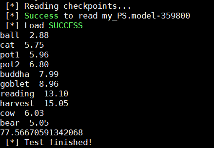
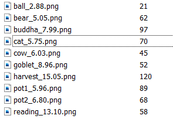

# GPS-Net
GPS-Net: Graph-based Photometric Stereo Network (NIPS 2020)

## Dependencies
GPS-Net is implemented in TensorFlow and tested with Ubuntu 16.04.
- Python 2.7.12
- TensorFlow 1.11.0
- numpy
- argparse
- scipy
- CUDA-9.0  

## Overview
We provide:
- checkpoint (pre-trained model under 16/32/64/96 inputs)
- checkpoint_4inputs (pre-trained model under 4 inputs)
- checkpoint_8_10inputs (pre-trained model under 8/10 inputs)
- diligent (DiLiGenT benchmark dataset)
- paper_result (results in the paper including error maps and estimated normal maps)
- test_data (pre-packed tfrecords test data)
- main.py  ops.py  PS.py  utils.py (testing code)
- test_data_tfrecords.py (code for making tfrecords dataset)

## Testing
Run the following command：
- python main.py

You will get the results as shown in the figure below.

The results will also be stored in 'result' directory, as shown in the figure below.

We provide the testing code and the tfrecords test data under 96 input images (stored in the 'test_data' directory).
To test under other numbers of input images, you can simply modify the parameters in test_data_tfrecords.py and run 
- python test_data_tfrecords.py

to generate your own test dataset. Then you should run 'python main.py' with '--N xxx'.
- python main.py --N xxx

## Matters needing attention
- The model in the checkpoint is finetuned, and its performance will be slightly better than the results in the paper. If you need to compare with the results in the paper, please use the data in the 'paper_result' directory. We provide raw (unvisualized) .mat data for your custom visualization.
- Same as CNN-PS, the first 20 samples of bear in the DiLiGenT dataset are discarded during the testing.
- Due to the limitations of video memory, the input images are divided into 100 * 100 patches during the testing. The results are stitched together to produce a complete output.

## Contact us
If you have any problem of the code, please contact: yaozk@tju.edu.cn
